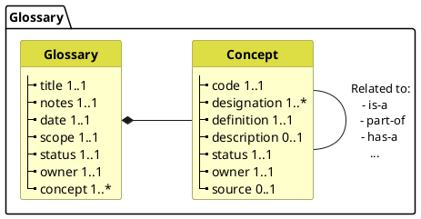

# Bienvenue dans CareSets

## Qu'est-ce qu'un CareSet?

Un **CareSet** est une collection standardisée de modèles de données logiques conçus pour faciliter l'interopérabilité et l'échange de données dans l'écosystème des soins de santé belge. Chaque CareSet définit un domaine ou un cas d'utilisation spécifique dans les soins de santé, fournissant une structure cohérente pour capturer, partager et analyser les informations de santé.

### Caractéristiques clés

**Modèles standardisés**: Les CareSets utilisent des modèles logiques basés sur FHIR qui définissent la structure et la sémantique des données de santé de manière standardisée.

**Spécifiques au domaine**: Chaque CareSet se concentre sur un domaine de soins de santé spécifique (par exemple, observations, médicaments, plans de soins) pour garantir la pertinence et l'applicabilité pratique.

**Interopérables**: Construits sur des normes internationales (FHIR) tout en intégrant les exigences et la terminologie spécifiques à la Belgique.

**Réutilisables**: Les éléments de données et les modèles communs sont conçus pour être réutilisés dans plusieurs CareSets, favorisant la cohérence et réduisant la redondance.

### Objectif

Les CareSets visent à:

- **Améliorer la qualité des données** en fournissant des définitions claires et non ambiguës des éléments de données de santé
- **Permettre l'interopérabilité sémantique** entre différents systèmes informatiques de santé
- **Soutenir la prise de décision clinique** grâce à des données standardisées et comparables
- **Faciliter l'analyse et la recherche de données** en garantissant une capture de données cohérente
- **Réduire la charge de mise en œuvre** en fournissant des modèles prêts à l'emploi et validés

### Structure

Chaque CareSet contient:

- **Modèles de données logiques**: StructureDefinitions FHIR qui définissent la structure des données
- **Liaisons terminologiques**: Liens vers des systèmes de codes standard (SNOMED CT, LOINC, etc.)
- **Glossaire**: Définitions des concepts et termes clés utilisés dans le CareSet
- **Documentation**: Directives d'utilisation, exemples et conseils de mise en œuvre

Parcourez les [Modèles de données logiques](logical-data-models) pour explorer les CareSets disponibles, ou consultez la [Feuille de route](roadmap) pour voir ce qui arrive ensuite.

