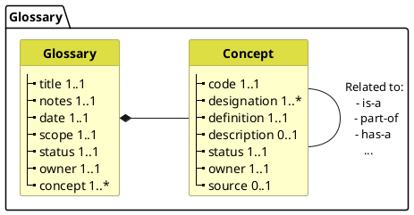

# Glossaries

Managing common definitions of data across projects requires common or comparable definitions. This document presents the glossary of business terms and a description of the governance of such glossary. 

> For the content glossary of terms used in describing the metadata framework, see the [glossary](glossary.html) page.


## Glossary requirements

Glossaries consist of a structured sets of concepts to be managed and used based on the following requirements:

* Concepts in a glossary have an identifier, at least one designation and definition, a status and an owner. 
* (conceptual) Definitions are captured, independently of any specific data structure.
  * for example "name" which can be patient name, practitioner name.  
  * Concept definitions SHALL support all their uses - i.e. the definition needs to be broad enough to support all the data elements that use and constrain the definition.  
    * for example "real current name of a person" can be used in patient or practitioner but cannot be used in aliases or other fictitious names, nor can be used to capture name history.  
  * Concepts can be more specific if needed - for example "patient name" may deserve its own place in a glossary, given its relevance.  
  See [definitions](definitions.html)  

* Concepts are associated with a unique identifier.
  See [identifiers](identifiers.html) for aspects related to the attribution and use of the unique identifiers.

* Concepts have a status (representing how the concept and definition)  

* Elements in a data structure SHOULD be mapped to a definition.  


The metadata structure meeting the requirements above is depicted here:




## Implementation

Glossaries are implemented in FHIR as CodeSystems.

```json
{
  "code": "allergy",
  "display": "Allergy",
  "designation": [
    {
      "language": "en",
      "value": "Allergy" 
    }
  ],
  "definition": "Risk of harmful or undesirable physiological response which is specific to an individual and associated with exposure to a substance or other agent.",
  "description": "Allergies can manifest in different ways, including skin reactions, respiratory symptoms, or anaphylaxis. Common allergens include pollen, dust mites, certain foods, and medications."
}
```
