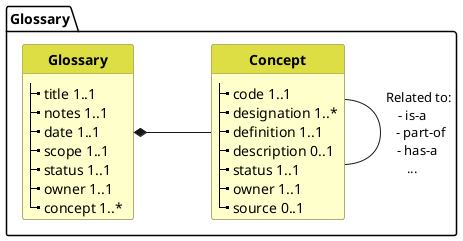

# Welkom bij CareSets

## Wat is een CareSet?

Een **CareSet** is een gestandaardiseerde verzameling van logische datamodellen die zijn ontworpen om interoperabiliteit en gegevensuitwisseling in het Belgische gezondheidszorgecosysteem te vergemakkelijken. Elke CareSet definieert een specifiek domein of use case binnen de gezondheidszorg en biedt een consistente structuur voor het vastleggen, delen en analyseren van gezondheidsinformatie.

### Belangrijkste kenmerken

**Gestandaardiseerde modellen**: CareSets gebruiken op FHIR gebaseerde logische modellen die de structuur en semantiek van gezondheidsgegevens op een gestandaardiseerde manier definiëren.

**Domeinspecifiek**: Elke CareSet richt zich op een specifiek gezondheidszorgdomein (bijv. observaties, medicijnen, zorgplannen) om relevantie en praktische toepasbaarheid te waarborgen.

**Interoperabel**: Gebouwd op internationale standaarden (FHIR) met integratie van Belgische specifieke vereisten en terminologie.

**Herbruikbaar**: Gemeenschappelijke gegevenselementen en patronen zijn ontworpen om te worden hergebruikt in meerdere CareSets, wat consistentie bevordert en redundantie vermindert.

### Doel

CareSets zijn erop gericht om:

- **Gegevenskwaliteit te verbeteren** door duidelijke, ondubbelzinnige definities van gezondheidszorggegevenselementen te bieden
- **Semantische interoperabiliteit mogelijk te maken** tussen verschillende IT-systemen voor de gezondheidszorg
- **Klinische besluitvorming te ondersteunen** door gestandaardiseerde, vergelijkbare gegevens
- **Gegevensanalyse en onderzoek te faciliteren** door consistente gegevensvastlegging te waarborgen
- **Implementatielast te verminderen** door kant-en-klare, gevalideerde modellen te bieden

### Structuur

Elke CareSet bevat:

- **Logische datamodellen**: FHIR StructureDefinitions die de gegevensstructuur definiëren
- **Terminologiebindingen**: Links naar standaard codesystemen (SNOMED CT, LOINC, etc.)
- **Woordenlijst**: Definities van belangrijke concepten en termen die in de CareSet worden gebruikt
- **Documentatie**: Gebruiksrichtlijnen, voorbeelden en implementatie-instructies

Blader door de [Logische datamodellen](logical-data-models) om beschikbare CareSets te verkennen, of bekijk de [Roadmap](roadmap) om te zien wat er komen gaat.

